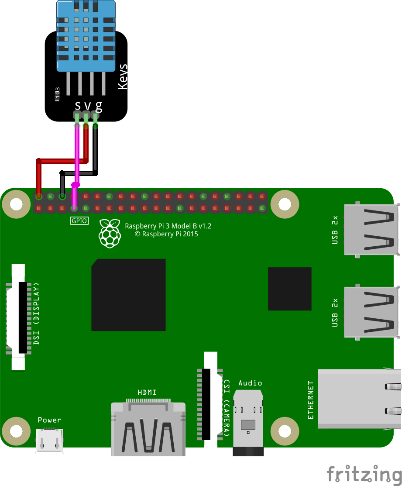

# project raspberry pi

## 라즈베리 파이 설치
- [라즈베리파이 공식 홈페이지](https://www.raspberrypi.org/)

## 라즈베리 파이 접속
- ID: pi
- PW: raspberry

## 라즈베리 파이 설정
``` $ sudo raspi-config ```
- Advanced Options -> Expand Filesystem

## 라즈베리 파이와 DHT 11 센서 연동
</img>

- 라이브러리 작성하기

``` 
  git clone https://github.com/adaruit/Adafruit_Python_DHT.git 
  cd Adafruit_Python_DHT
  sudo python setup.py install
  ```
- 실행하기

```python AdafruitDHT.py 11 4 ```  // 11센서 4번핀

달팽이</img>
